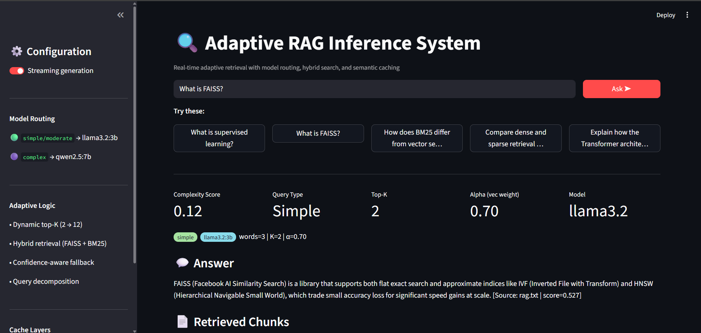

# Adaptive-Retrieval-Intelligence-System-ARIS


An advanced Retrieval-Augmented Generation (RAG) system that dynamically adapts retrieval depth, retrieval strategy, caching, and model routing at inference time for faster and higher-quality responses.

Built with:
- FAISS vector search
- BM25 sparse retrieval
- Hybrid retrieval fusion
- Adaptive top-K retrieval
- Query complexity analysis
- Semantic + exact caching
- Query decomposition
- Confidence-aware fallback
- Local LLM inference using Ollama
- Streamlit dashboard
- ANN benchmarking experiments

---

# Features

## Adaptive Retrieval
- Dynamically adjusts retrieval depth (`top-K`) based on:
  - query complexity
  - latency feedback
  - answer quality
- Runtime hybrid retrieval balancing:
  - Dense semantic retrieval
  - Sparse BM25 retrieval

---

## Hybrid Search
Combines:
- FAISS dense vector search
- BM25 keyword retrieval

Benefits:
- semantic understanding
- exact keyword matching
- better recall on real-world queries

---

## Query Complexity Analysis
Rule-based query analyzer scores queries using:
- word count
- specificity
- conjunction load
- clause count
- question depth

Automatically classifies queries as:
- simple
- moderate
- complex

---

## Intelligent Model Routing
Routes queries dynamically:
- `llama3.2:3b` → fast simple/moderate queries
- `qwen2.5:7b` → complex reasoning queries

---

## Semantic + Exact Cache
Two cache layers:
- Exact LRU cache
- Semantic similarity cache using embeddings

Example:
- Cached: `"What is ML?"`
- Query: `"Explain machine learning"`

→ semantic cache hit

---

## Query Decomposition
Complex queries are automatically decomposed into atomic sub-questions and executed in parallel.

Example:

```text
Compare dense and sparse retrieval and explain hybrid retrieval.
```

becomes:

```text
1. What is dense retrieval?
2. What is sparse retrieval?
3. How does hybrid retrieval combine both?
```

---

## Confidence-Aware Fallback
If generated answer quality is low:
- retrieval depth increases
- query automatically retries
- more context is retrieved

---

## Streaming Generation
Supports live token streaming from Ollama models.

---

## Interactive Dashboard
Streamlit dashboard includes:
- live adaptive retrieval visualization
- dynamic top-K tracking
- cache monitoring
- latency analytics
- model routing display
- retrieved chunk inspection
- hybrid retrieval analysis

---

# Architecture

```text
                    ┌────────────────────┐
                    │    User Query      │
                    └─────────┬──────────┘
                              │
                    ┌─────────▼──────────┐
                    │ Query Analyzer     │
                    └─────────┬──────────┘
                              │
                    ┌─────────▼──────────┐
                    │ Decision Layer     │
                    │ Dynamic Top-K      │
                    │ Alpha Selection    │
                    └─────────┬──────────┘
                              │
              ┌───────────────┴────────────────┐
              │                                │
      ┌───────▼────────┐              ┌────────▼────────┐
      │ Vector Search  │              │ BM25 Search     │
      │ (FAISS)        │              │ Keyword Search  │
      └───────┬────────┘              └────────┬────────┘
              │                                │
              └──────────────┬─────────────────┘
                             │
                   ┌─────────▼─────────┐
                   │ Hybrid Fusion     │
                   │ + Reranking       │
                   └─────────┬─────────┘
                             │
                   ┌─────────▼─────────┐
                   │ Generator         │
                   │ Ollama LLM        │
                   └─────────┬─────────┘
                             │
                   ┌─────────▼─────────┐
                   │ Final Response    │
                   └───────────────────┘
```

---

# Screenshots

## Dashboard UI



The Streamlit dashboard provides:
- Live adaptive retrieval visualization
- Dynamic Top-K tracking
- Hybrid retrieval inspection
- Query complexity analysis
- Cache monitoring
- Latency analytics
- Model routing display
- Retrieved chunk inspection

---

# Project Structure

```text
NeuroRAG-Adaptive-Engine/
│
├── adaptive/
│   ├── cache.py
│   ├── decision_layer.py
│   ├── decomposer.py
│   ├── feedback.py
│   └── query_analyzer.py
│
├── generation/
│   └── generator.py
│
├── ingestion/
│   └── document_loader.py
│
├── retrieval/
│   ├── ann_experiments.py
│   ├── hybrid_retriever.py
│   ├── keyword_search.py
│   ├── reranker.py
│   └── vector_store.py
│
├── tests/
│   └── test_all.py
│
├── Screenshots/
│   └── Result.png
│
├── dashboard.py
├── pipeline.py
├── main.py
├── config.py
├── requirements.txt
└── README.md
```

---

# Tech Stack

- Python
- FAISS
- SentenceTransformers
- BM25
- Ollama
- Streamlit
- PyTest
- NumPy
- Pandas

---

# Installation

## 1. Clone the repository

```bash
git clone https://github.com/AdithyaRaoK14/Adaptive-RAG-Inference-System.git
cd Adaptive-RAG-Inference-System
```

---

## 2. Create virtual environment

### Windows

```bash
python -m venv venv
venv\Scripts\activate
```

### Linux / Mac

```bash
python3 -m venv venv
source venv/bin/activate
```

---

## 3. Install dependencies

```bash
pip install -r requirements.txt
```

---

## 4. Install Ollama

Download Ollama:

https://ollama.com

Pull required models:

```bash
ollama pull llama3.2:3b
ollama pull qwen2.5:7b
```

---

# Running the Project

## Run CLI Demo

```bash
python main.py
```

Demonstrates:
- adaptive retrieval
- semantic caching
- model routing
- decomposition
- confidence fallback

---

## Run Streamlit Dashboard

```bash
streamlit run dashboard.py
```

Open:

```text
http://localhost:8501
```

---

# Running Tests

```bash
pytest tests/ -v
```

Current results:

```text
34 passed in 0.61s
```

GitHub Actions automatically runs tests on:
- every push
- pull requests

---

# ANN Benchmark Results

The project includes FAISS ANN benchmark experiments comparing:

- IndexFlatIP
- IndexIVFFlat
- IndexHNSWFlat
- IndexIVFPQ

## Benchmark Configuration

- Corpus Size: 10,000 vectors
- Embedding Dimension: 384
- Queries: 200
- Top-K: 5

---

## Results

| Index Type | Settings | P50 Latency | P95 Latency | Recall@5 |
|---|---|---|---|---|
| IndexFlatIP | Exact Search | 1.50 ms | 2.25 ms | 100.0% |
| IndexIVFFlat | nprobe=1 | 0.035 ms | 0.043 ms | 4.5% |
| IndexIVFFlat | nprobe=5 | 0.091 ms | 0.110 ms | 15.1% |
| IndexIVFFlat | nprobe=10 | 0.153 ms | 0.188 ms | 25.9% |
| IndexIVFFlat | nprobe=20 | 0.300 ms | 0.366 ms | 42.1% |
| IndexIVFFlat | nprobe=50 | 0.689 ms | 1.117 ms | 74.3% |
| IndexHNSWFlat | M=32 | 0.255 ms | 0.378 ms | 26.2% |
| IndexIVFPQ | M=32, bits=8 | 0.367 ms | 0.436 ms | 11.2% |

---

## Findings

- `IndexFlatIP` provides exact retrieval and is ideal for small corpora.
- `IndexIVFFlat` provides excellent speed with tunable recall.
- `IndexHNSWFlat` offers strong latency performance with higher memory usage.
- `IndexIVFPQ` minimizes memory usage through vector compression.

---

## Recommendation

- Small corpora (<100k chunks): `IndexFlatIP`
- Medium corpora (100k+ chunks): `HNSW`
- Large corpora (1M+ chunks): `IVFPQ`

---

# Example Queries

```text
What is supervised learning?

What is FAISS?

How does BM25 differ from vector search?

Compare dense and sparse retrieval in RAG systems.

Explain how Transformers replaced RNNs.
```

---

# Performance Highlights

## Adaptive Retrieval
- Dynamic top-K retrieval
- Runtime alpha tuning
- Hybrid retrieval fusion

## Optimization
- FAISS ANN indexing
- Streaming generation
- Semantic caching
- Parallel decomposition

## Evaluation
- ANN benchmarking
- Latency tracking
- Retrieval analytics
- Query quality estimation

---

# Future Improvements

- Cross-encoder reranking
- Multi-modal RAG
- Persistent vector database
- Distributed retrieval
- Knowledge graph integration
- GPU acceleration
- Agentic query planning
- Multi-user deployment

---

# Test Coverage

The project includes tests for:
- document chunking
- vector search
- BM25 retrieval
- hybrid retrieval
- reranking
- query analysis
- caching
- adaptive planning

---

# License

MIT License

---

# Author

Adithya Rao Kalathur
